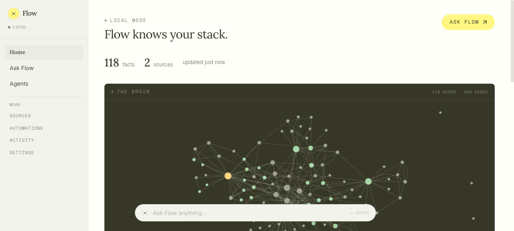
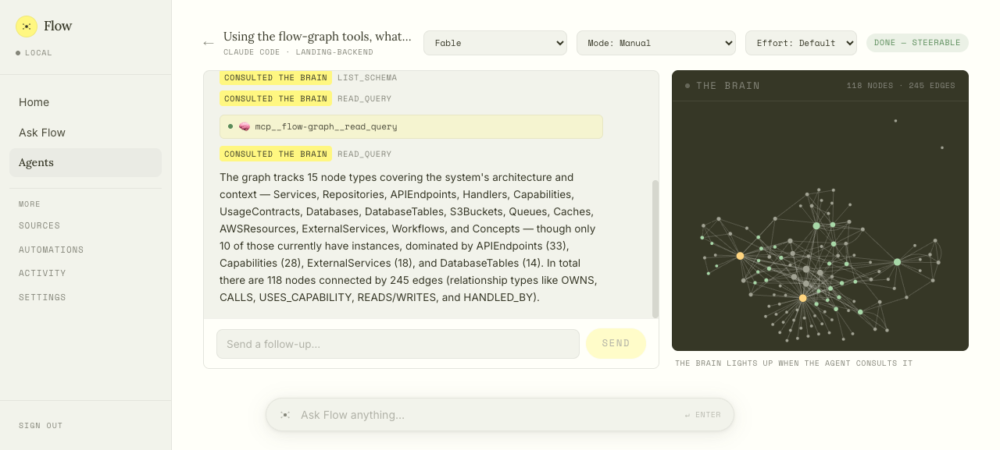
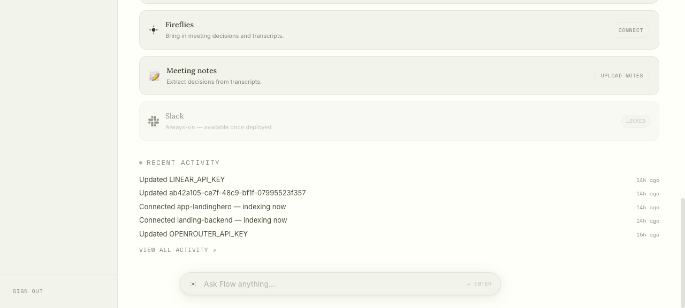

<div align="center">

# Flow

### Your engineering partner. Built to keep you in flow.

Flow builds your brain outside your head: a knowledge graph of your services and how they connect — the way you hold your system in your mind — plus a memory of everything you tell it. Your coding agents (Claude Code, Codex, OpenCode) plug into that brain, so they act with your understanding and take the smart actions you would. Run tasks in parallel, steer with minimum input, stay in flow.



[Install](#install) · [What you get](#what-you-get) · [How it works](#how-it-works) · [Roadmap](ROADMAP.md) · AGPL-3.0

</div>

---

## Install

```bash
curl -fsSL https://www.flow.engineer/install.sh | bash

flow up myproject
```

That's it. `flow up` prints your dashboard URL — open it, connect a repo, and watch the graph build. Then ask questions from the floating bar or kick off a coding agent from the **Agents** tab.

**You'll need:** Node 22+ and Docker running. Indexing runs through a coding CLI you already have — Claude Code, Codex, or opencode — and if you have none, the installer sets up opencode for you. Everything runs on your machine; your code never leaves it.

<details>
<summary>Other ways to install</summary>

From a checkout:

```bash
git clone https://github.com/samyakkkk/flow.git && cd flow
./setup.sh
```

Manual: `npm install && npm install -g .` — `setup.sh` just does everything in one shot.

Works on macOS and Linux natively; on Windows use Git Bash or WSL2.

</details>

---

## What you get

**Your system, mapped the way you think about it.** Connect your repos and Flow builds a knowledge graph of your services, APIs, and the connections between them — across repos, the way it looks in your mind. Ask it anything; answers come with `file:line` evidence, not guesses.

**Run tasks in parallel, with the coding CLIs you already use.** Claude Code, Codex, and OpenCode, driven from one dashboard: kick off several tasks at once, pick a model per session, steer mid-run, approve permissions from the browser. No terminal juggling.



**Agents that act like you would.** Every session starts with your brain plugged in — the agent already knows which service owns what and what breaks if it changes something. You watch it consult the graph live, and you only step in when it matters.

**It remembers everything you tell it.** Decisions, gotchas, "we never do X" — say it once and it's part of the brain, surfaced to you and every future agent session automatically.

**A brain that grows with your team.** Connect Slack, Linear, and meeting transcripts and the same graph accumulates your team's context and decisions — with every automated behavior a policy toggle (auto / propose / off).

---

## How it works

```
connect sources ──▶ agents build the evidence-backed graph ──▶ answers, agents & context
  (repos, Slack,        (every claim carries file:line             (grounded Q&A, agent
   Linear, meetings)     evidence and confidence)                   sessions, Linear context)
```

Flow runs a few small services on your machine: a graph database (FalkorDB, in Docker), a gateway that governs every graph write, an orchestrator that runs the pipeline, and a dashboard. Each project is a self-contained folder with its own graph, database, and cloned repos — multiple projects run side by side.

```
flow up   [name]     # start a project (creates it if new); no name = all
flow down [name]     # stop a project; no name = all
flow ls              # projects, status, and dashboard URLs
flow doctor          # health check
```

Full design in [`docs/ARCHITECTURE.md`](docs/ARCHITECTURE.md).

---

## Connecting sources



Everything is configured in the dashboard — no env files. **GitHub** repos get indexed into the graph; **Linear** tickets are enriched with an auto-maintained CONTEXT BY FLOW section; **Fireflies** meeting transcripts become searchable evidence; **Slack** answers in-thread (deployed mode only — a laptop can't be always-on). Keys are encrypted at rest and applied without restarts.

---

## Self-hosting

Flow runs the same everywhere; the mode decides what's on.

- **Local** (default) — build the graph, ask questions, run agents, poll GitHub / Linear / Fireflies. Needs nothing but your laptop + Docker.
- **Deployed** (`--mode prod`, on any small always-on box) — everything above plus the always-on Slack bot.

Your data stays on your infrastructure either way.

---

## Troubleshooting

`flow doctor` gives a health summary; services log to `data/projects/<name>/logs/`. Common fixes (wrong Node version, Docker not running, port conflicts) are in [`docs/troubleshooting.md`](docs/troubleshooting.md).

---

## Contributing

Issues and PRs welcome. Everything is testable without real credentials:

```bash
bash verify-all.sh   # typecheck + tests + simulator scenarios + dashboard smoke
```

Run it before opening a PR and add a `CHANGELOG.md` entry. For larger changes, open an issue first.

To test branches side by side, the installer can set up any branch as its own command (`--alias`, `--branch`), with its own ports and even its own database (`--port-offset`, `--fresh-db`) — see [`docs/testing.md`](docs/testing.md).

Flow is early and moving fast — see [`ROADMAP.md`](ROADMAP.md) for what's next and [`CHANGELOG.md`](CHANGELOG.md) for dated history.

## License

[GNU AGPL-3.0](LICENSE). You're free to self-host, use, and modify Flow — including inside a company for internal purposes. If you run a modified version as a network service, the AGPL requires you to share those modifications under the same license. (For a commercial license without the copyleft terms, get in touch.)

## Acknowledgements

Built on the shoulders of [OpenCode](https://opencode.ai) (the agent runtime), [FalkorDB](https://www.falkordb.com) (the graph store and its renderer), and the [Agent Client Protocol](https://agentclientprotocol.com) (driving Claude Code, Codex, and OpenCode from one place).
