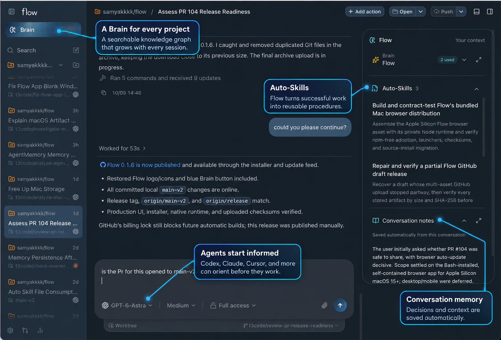
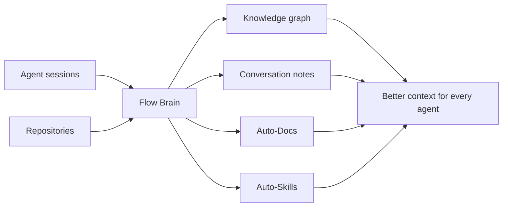
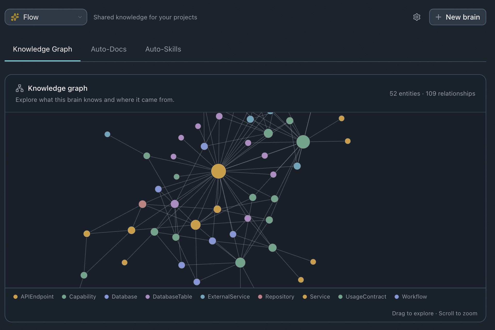

<div align="center">
  <picture>
    <source media="(prefers-color-scheme: dark)" srcset="./apps/web/public/brand-wordmark-on-dark.svg">
    <source media="(prefers-color-scheme: light)" srcset="./apps/web/public/brand-wordmark-on-light.svg">
    
  </picture>

  <h3>Coding harness with a brain.</h3>

  <p>Run your coding agents. Flow remembers the work.</p>
</div>

Flow is an open-source workspace for coding agents. Start a task with the coding
agent you already use, and Flow captures the session into a project Brain: a searchable
knowledge graph, retained conversation notes, living documentation, and reusable
skills that improve as the project evolves.

You keep coding while Flow maintains the context agents usually lose between
sessions. When another agent picks up the work, it can orient itself from the same
Brain instead of asking you to explain the codebase and its decisions again.

<p align="center">
  
</p>

## Install

Flow installs two ways, and they share one local Flow service and one Brain. The
desktop app gives you a native window. The install script gives you the `flow`
command and the same Flow in your browser. Use either or both: coding agents you run
outside Flow keep working with the Brain whether or not a window is open.

```bash
curl -fsSL https://raw.githubusercontent.com/samyakkkk/flow/release/install.sh | bash
```

Installs the `flow` command and Flow's local service with its own Node runtime, so
you do not need Node, npm, Homebrew, Docker, or Git. Run `flow` to open Flow in
your browser; `flow service install` keeps it running in the background from login.
Apple Silicon macOS 15 or newer. Updates are prepared automatically; run `flow update`
to check now. See [Install Flow](./docs/user/install.md) for options and
[Run Flow in the background](./docs/user/local-instances.md) for the service commands.

<p align="center"><strong>— or download the desktop app —</strong></p>

<p align="center">
  <a href="https://github.com/samyakkkk/flow/releases/download/flow-desktop-v0.1.4/Flow-0.1.4-arm64.dmg"></a>
  <a href="https://github.com/samyakkkk/flow/releases/download/flow-desktop-v0.1.4/Flow-0.1.4-x64.dmg"></a>
  <a href="https://github.com/samyakkkk/flow/releases/download/flow-desktop-v0.1.4/Flow-0.1.4-x86_64.AppImage"></a>
  
</p>

<p align="center">Flow 0.1.4 · macOS 15+ · Ubuntu 24.04 or compatible · signed, notarized, auto-updating<br>
Checksums and updater assets are on the <a href="https://github.com/samyakkkk/flow/releases/tag/flow-desktop-v0.1.4">Flow 0.1.4 release</a>.</p>

## Why Flow

Most coding harnesses remember a chat. Flow builds project knowledge from the work
inside every chat.

- **Bring your own agent.** Use Codex, Claude Code, Cursor, Grok Build, OpenCode,
  or Google Antigravity with the accounts and subscriptions already configured on
  your machine.
- **One Brain per workspace.** Flow indexes your repositories into a graph of
  services, capabilities, APIs, resources, and the relationships between them.
- **Context that survives sessions.** Each agent can orient itself, search the
  graph, retrieve past decisions, and follow the evidence back to code.
- **Auto-Docs and Auto-Skills.** Flow turns work into maintained documentation and
  reusable procedures. You do not have to keep rewriting project instructions or
  manually curate a folder of skills.
- **Parallel work without losing control.** Run multiple threads and worktrees,
  inspect diffs, use integrated terminals, and restore checkpointed workspace
  state.
- **Local by default.** Your projects, provider credentials, agent processes, and
  local Brain stay on the machine that owns the workspace.
- **Remote ready.** Connect from another browser, desktop, or phone while execution
  remains on the host machine.

## How the Brain works



Flow passively captures the evidence already produced during a coding session. It
uses that evidence to keep conversation notes, project knowledge, documentation,
and skills current. Agents consult the Brain before working and can trace recalled
context back to its source instead of relying on a loose prompt summary.

The local app starts and manages the Brain automatically, so you can create a
project and begin working without configuring a separate service.

<p align="center">
  
</p>

## Coming soon

- Shared team Brains, so knowledge follows the project across teammates
- Linear integration for issues, decisions, and delivery context
- Slack integration for searchable conversations and shared project context
- Windows desktop app

## Get started

1. Install Flow, as the desktop app or with the install script, and open it.
2. Add a local project.
3. Choose or create its Brain.
4. Select a coding provider and start a thread.

The Brain indexes the repository and grows as you work. Open **Brain** in the
sidebar to explore its **Knowledge Graph**, **Auto-Skills**, and retained context.

Flow works with:

| Provider    | Setup                                                                                       |
| ----------- | ------------------------------------------------------------------------------------------- |
| Codex       | [Install Codex CLI](https://developers.openai.com/codex/cli), then run `codex login`        |
| Claude Code | [Install Claude Code](https://claude.com/product/claude-code), then run `claude auth login` |
| Cursor      | [Install Cursor CLI](https://cursor.com/cli), then run `agent login`                        |
| Grok Build  | [Install Grok Build CLI](https://x.ai/cli), then run `grok login`                           |
| OpenCode    | [Install OpenCode](https://opencode.ai), then run `opencode auth login`                     |
| Antigravity | Install and sign in with Google from Flow's provider settings                               |

Provider CLIs run on the environment that owns the project. See
[installation and provider setup](./docs/user/install.md) for binary paths,
multiple accounts, and remote environments.

## Documentation

- [Install with the script or from source](./docs/user/install.md)
- [Run Flow in the background](./docs/user/local-instances.md)
- [Working with threads](./docs/user/thread-sidebar.md)
- [Permission modes](./docs/user/permission-modes.md)
- [Keyboard shortcuts](./docs/user/keybindings.md)
- [Project settings and Brain](./docs/user/project-settings.md)
- [Remote access](./docs/user/remote-access.md)
- [Updating Flow](./docs/user/updating.md)
- [Source control integrations](./docs/user/source-control.md)

Building from source? Start with the [development guide](./docs/operations/development.md)
and read [CONTRIBUTING.md](./CONTRIBUTING.md).

## Project status

Flow is early. Expect rough edges and frequent changes. Small fixes are welcome;
please report problems and propose changes in
[GitHub Issues](https://github.com/samyakkkk/flow/issues).

## Built on T3 Code

Flow uses the open-source [T3 Code](https://github.com/pingdotgg/t3code) agent
harness as its interface and runtime foundation. T3's original Git history and
license notices are preserved. Flow's active Brain packages live under
[`flow-t3/shared/`](./flow-t3/README.md).

See [NOTICE.md](./NOTICE.md) and [LICENSE](./LICENSE) for attribution and license
details.
