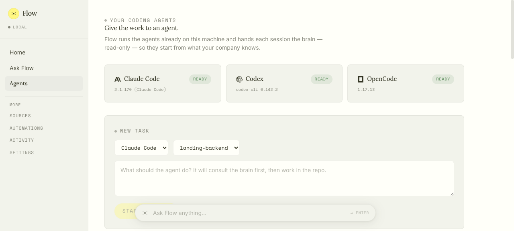

<div align="center">

# Flow

### Flow knows your stack.

A self-hostable **knowledge graph + agent runner for your codebase.** Point it at your repos and it builds a living graph of your services, capabilities, APIs, and how they connect — then answers questions with citations and runs your existing coding agents (Claude Code, Codex, OpenCode) with that graph injected into every session.


[Quickstart](#quickstart) · [What you get](#what-you-get) · [How it works](#how-it-works) · [Roadmap](ROADMAP.md) · AGPL-3.0

</div>

---

## Why Flow

Coding agents are only as good as the context you feed them, and most of a codebase's real structure — which service owns what, what depends on this API, what breaks if you change a response field — lives in people's heads or scattered across repos.

Flow builds that structure into a graph and puts it at the center of everything. It's genuinely useful for a **solo developer working across several repos** — it maps the connections *between* your services and repositories (which frontend calls which backend capability, what a shared library is used by), so both you and your coding agents reason across the whole system, not one repo at a time. The same graph then **grows into a team brain** as you connect Slack, Linear, and meeting transcripts.

Run it on your laptop, or **host it on your own EC2** (or any always-on box) and drive everything — the graph, agents, and integrations — from the cloud. Your data stays on your infrastructure either way.

The graph is the center. Both you and your agents build from it.

---

## What you get

### Understand your codebase

- **A living knowledge graph** — connect a repo and Flow indexes it into a graph of services, capabilities, APIs, resources, and the *usage contracts* between them. Every claim carries evidence, confidence, and provenance, written through a single governed gateway so many writers can't rot the ontology.
- **Grounded Q&A with citations** — ask from a floating bar on any page. Answers come back with `file:line` evidence, a plain-language confidence, and the answer's subgraph highlighted on the graph — not a guess.
- **A graph you can actually read** — a force-directed constellation with degree-sized, type-colored nodes and semantic zoom; click any node for a plain-language card.

### Run your coding agents from one place


- **Claude Code, Codex, and OpenCode**, detected on your machine and driven over the [Agent Client Protocol](https://agentclientprotocol.com) from the dashboard — no terminal juggling.
- **Pick the model per session** — Claude Code (5 models + effort), Codex (2 models + reasoning effort), OpenCode (500+ models). The choice applies live and survives reload.
- **Full session control from the browser** — streaming transcript with collapsible thinking and tool rows, follow-up steering when idle, mid-run interrupts, Stop, real permission cards (Allow / Always allow / Reject), and agent-mode switching.
- **The graph is injected into every session** as a read-only MCP (`find_entity` / `get_entity` / `read_query` / `list_schema`). The agent gets grounded context for free — no config files — and the session view **highlights the exact nodes it consults**, live ("7 nodes consulted by this session"), with "consulted the brain" markers in the transcript.

### Grow into a team brain

- **Connect Slack, Linear, and Fireflies** meeting transcripts alongside your repos, all from the dashboard. Conversational knowledge attaches to the graph without overwriting code-derived truth.
- **CONTEXT BY FLOW on Linear tickets** — an auto-maintained, idempotent section enriched with code truth and related discussion, so whoever (or whatever) picks up the ticket starts with the full picture.
- **Everything is a policy toggle** — every automated behavior is auto / propose / off, and every action is audited with provenance.

---

## Quickstart

**Prerequisites:** **Node 22+** (`nvm install 22` — there's an `.nvmrc`) and **Docker** running. Flow starts FalkorDB (its graph database) in a container for you — or point it at your own and skip Docker (`FALKOR_HOST=… flow up`). You'll add an [OpenRouter](https://openrouter.ai) key in the dashboard on first run. **Nothing else to install** — the graph engine (opencode) is bundled.

To *also* run coding agents from the dashboard, install any of Claude Code, Codex, or OpenCode; Flow detects whatever's already on your machine.

```bash
git clone <repo> && cd flow
npm install && npm install -g .    # deps + `flow` on your PATH

flow up mycompany                  # creates it if new, then starts — prints your dashboard URL
```

Then it's all in the browser:

1. **Open the dashboard URL.** In local mode you're already signed in — no token to paste.
2. **Add your OpenRouter key** (nothing else is reachable until the brain has a model).
3. **Connect a repo** from the Home picker (uses your `gh` login, a PAT, or a public URL) and watch the graph build.
4. **Ask a question** from the floating bar, or head to **Agents** to kick off a coding task.

> A one-command installer (`curl … | bash`) that also provisions Node + Docker is on the [roadmap](ROADMAP.md). The steps above are the current path.

### CLI

```
flow up   [name]     # start a project (creates it if new); no name = all
flow down [name]     # stop a project; no name = all
flow ls              # projects, status, and dashboard URLs
```

Each project is a self-contained folder (`data/projects/<name>/`) with its own graph, database, secrets, and cloned repos. Multiple projects run side by side on separate port triplets, sharing FalkorDB via named graphs.

---

## How it works

Flow is a small set of local services, graph at the center:

```
connect sources ──▶ agents build the evidence-backed graph ──▶ answers, agents & context
  (repos, Slack,        (OpenCode workers write through a          (grounded Q&A, coding-agent
   Linear, meetings)     governed gateway; every claim              sessions with the graph
                         has provenance + confidence)               injected, Linear context)
```

**Three storage tiers**, each holding a claim exactly once:

- **FalkorDB graph** — distilled durable knowledge (services, capabilities, usage contracts). One named graph per project.
- **SQLite corpus (FTS)** — searchable evidence: Slack messages, a Linear mirror, meeting segments. What graph claims cite.
- **Systems of record** — Slack / Linear / GitHub stay the source of truth; fast-moving state is joined at read time, never frozen into the graph.

The **orchestrator** runs a deterministic pipeline — event → LLM classifier → policy lookup (auto / propose / off) → single-write action layer → audit log. Agents produce content; only the service performs side effects, which is what makes the permission matrix enforceable and defends against prompt injection. All graph writes go through the **gateway's** typed verbs (never raw Cypher), so the ontology stays clean under many concurrent writers.

Full design in [`docs/ARCHITECTURE.md`](docs/ARCHITECTURE.md); agent-dispatch design in [`docs/AGENT_DISPATCH.md`](docs/AGENT_DISPATCH.md).

---

## Using your coding agents



1. **Connect a repo** on Home so there's a checkout for the agent to work in.
2. Open **Agents** — installed agents (Claude Code / Codex / OpenCode) show up with live detection; missing ones show install hints.
3. Kick off a task: pick an agent, a connected repo, a model + effort level, and write your prompt.
4. **Steer it** — send follow-ups when it's idle, interrupt and redirect mid-run, approve or reject permission requests from the browser, switch agent mode, or Stop.
5. **Watch the graph light up** — the session panel highlights the exact nodes the agent queries, and answers come back citing real files.

The dashboard never spawns processes itself — everything rides the orchestrator's HTTP API, so the same flow will work in cloud mode later.

---

## Connecting more sources


All sources are configured **in the dashboard**, not in env files. Keys are AES-256-GCM encrypted in the project database, masked in responses, and hot-applied — adding a key starts its poller immediately, no restart.

- **GitHub** — connect repos with the picker (gh CLI, PAT, or public URL); each gets indexed into the graph.
- **Linear** — polled since a cursor; tickets enriched with CONTEXT BY FLOW.
- **Fireflies** — meeting transcripts ingested as searchable evidence (plus manual meeting-note upload).
- **Slack** — ambient in-thread answering. **Deploy-only:** a laptop can't be always-on, so local mode locks Slack ("deploy to enable").

Non-Slack sources all use one poll-since-cursor mechanism, so catching up after downtime — a 30-second reboot or a 3-day outage — is the same operation.

---

## Self-hosting

Flow runs the same everywhere; the mode decides what's on.

- **Local** (`--mode local`, default) — build the graph, ask questions, run coding agents, poll GitHub / Linear / Fireflies. Slack is disabled. This is the solo-developer path and needs nothing but your laptop + Docker.
- **Deployed** (`--mode prod`, on a small always-on box like EC2) — everything above plus the always-on Slack bot.

Your data stays on your infrastructure. A single admin token guards every HTTP surface, agents that read untrusted content never hold write-to-the-world tools, and every action is audited.

One-command install, `flow export` / `import` project migration (local → EC2 by moving one bundle), and systemd-managed always-on deploys are on the [roadmap](ROADMAP.md).

---

## Roadmap

Shipped and honest about what's next — see [`ROADMAP.md`](ROADMAP.md) for the full detail. Highlights of what's coming:

- **One-command installer** (`curl -fsSL … | bash`) that provisions Node + opencode + Docker.
- **Agent dispatch across machines** via Shellular + a streamable-HTTP graph MCP endpoint, so Flow on a server can drive an agent on your laptop with the graph injected.
- **Per-repo MCP config on connect** + `flow mcp install`, so your own hand-run agents get the graph tools too.
- **`flow acp`** — expose Flow's answerer as an agent you can register in Shellular or Zed.
- **Project migration** (`flow export` / `import`) and **EC2 always-on** under systemd.

Flow is early and moving fast. See [`CHANGELOG.md`](CHANGELOG.md) for dated history.

---

## Troubleshooting

- **`npm install` fails on an old Node, or with a SQLite build error** — Flow needs **Node 22+**. `nvm install 22 && nvm use 22`, then `npm install` again. (On 22+, SQLite installs a prebuilt binary — no C/C++ toolchain required.)
- **`flow up` says a dependency "was built for a different Node version"** (or the orchestrator log shows `NODE_MODULE_VERSION` / `ERR_DLOPEN_FAILED`) — a leftover from an install attempt on another Node is shadowing the fresh install. Clean reinstall from the flow directory: `rm -rf node_modules orchestrator/node_modules graph-gateway/node_modules dashboard/node_modules && npm install`.
- **`flow up` says Docker isn't installed / the daemon isn't running** — start Docker Desktop and re-run. Prefer no Docker? Run FalkorDB yourself and point Flow at it: `FALKOR_HOST=<host> FALKOR_PORT=<port> flow up`.
- **Port 6379 already in use** — another Redis/FalkorDB holds it. Free it, or reuse that instance with `FALKOR_HOST` / `FALKOR_PORT` as above.
- **"Unable to find image 'falkordb/falkordb:latest'" / image download fails** — the first-run image pull failed. `flow up` prints the real cause; if it mentions a rate limit, `docker login` (a free Docker Hub account raises the anonymous pull limit) or wait an hour. Otherwise check connectivity/VPN and re-run `flow up`.
- **A service "didn't start"** — read `data/projects/<name>/logs/{gateway,orchestrator,dashboard}.log`, and run `flow doctor` for a health summary.
- **Brain stuck on "Building…" / index job `opencode exited 1`** — the graph tools need `@opencode-ai/plugin` in the project workspace. `flow up` installs it; if an older project predates that, run `npm install --prefix data/projects/<name>/workspace/.opencode` then reindex from the dashboard. Job logs under `data/projects/<name>/job-logs/` show `Cannot find module '@opencode-ai/plugin'` when this is the cause.
- **Connecting a repo fails** — cloning needs `git` on your PATH.
- **"still starting up" when you save your key** — the orchestrator takes a few seconds on first boot; wait and retry.
- **Don't `docker compose up` for local dev** — use `flow up`. The compose file under `deploy/` is an experimental full-container path, not the local one.

---

## Contributing

Issues and PRs welcome. Everything is testable without real credentials — the simulators drive the full pipeline.

```bash
bash verify-all.sh   # typecheck + orchestrator tests + simulator scenarios + dashboard smoke
```

Please run `verify-all.sh` before opening a PR and add a `CHANGELOG.md` entry. For larger changes, open an issue first to discuss the approach.

## License

[GNU AGPL-3.0](LICENSE). You're free to self-host, use, and modify Flow — including inside a company for internal purposes. If you run a modified version as a network service, the AGPL requires you to share those modifications under the same license. (For a commercial license without the copyleft terms, get in touch.)

## Acknowledgements

Built on the shoulders of [OpenCode](https://opencode.ai) (the agent runtime), [FalkorDB](https://www.falkordb.com) (the graph store and its renderer), and the [Agent Client Protocol](https://agentclientprotocol.com) (driving Claude Code, Codex, and OpenCode from one place).
